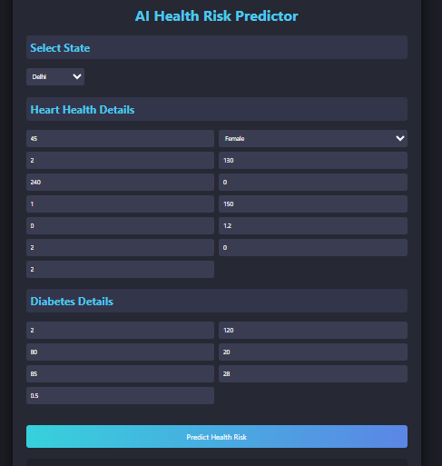
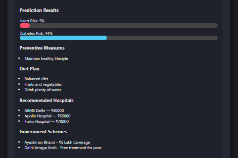

# AI Health Risk Predictor

An AI-powered healthcare prediction system that predicts **Heart Disease Risk** and **Diabetes Risk** using machine learning models.  

The system also provides:

- Preventive health measures
- Personalized diet recommendations
- State-wise hospital suggestions with price comparison
- Government healthcare scheme recommendations

---

## Project Demo

### Main Interface

### Prediction Results

---

## Features

- Heart disease risk prediction
- Diabetes risk prediction
- Preventive healthcare suggestions
- Diet recommendations
- State-wise hospital recommendations
- Government scheme suggestions
- Interactive dashboard UI

---

## Tech Stack

### Backend
- Python
- FastAPI
- Scikit-learn
- NumPy
- Joblib

### Frontend
- HTML
- CSS
- JavaScript

---

## Project Architecture
User Input (Health Data)
↓
Frontend Dashboard
↓
FastAPI Backend
↓
Machine Learning Models
↓
Risk Prediction + Recommendations

## Installation

Clone the repository

git clone https://github.com/aman1ace/ai-healthcare3.0.git

Move into the project folder

cd AI-Health-Risk-Predictor

Install dependencies

pip install fastapi uvicorn scikit-learn numpy pandas joblib

Run the backend server

uvicorn src.main:app --reload

Open the frontend

frontend/index.html

---

## Example Output

Heart Risk: 35%  
Diabetes Risk: 42%

Preventive Measures

- Exercise regularly
- Reduce sugar intake
- Maintain healthy weight

Diet Plan

- Whole grains
- Leafy vegetables
- Balanced diet

Recommended Hospitals

- AIIMS Delhi — ₹40,000
- Apollo Hospital — ₹65,000
- Fortis Hospital — ₹70,000

Government Schemes

- Ayushman Bharat
- Delhi Arogya Kosh

---

## Future Improvements

- Smartwatch health data integration
- Real-time hospital data
- Google Maps hospital locator
- Mobile app version
- Deep learning based prediction

---

## Author

Aman 
B.Tech Artificial Intelligence & Data Science(GGSIPU)
